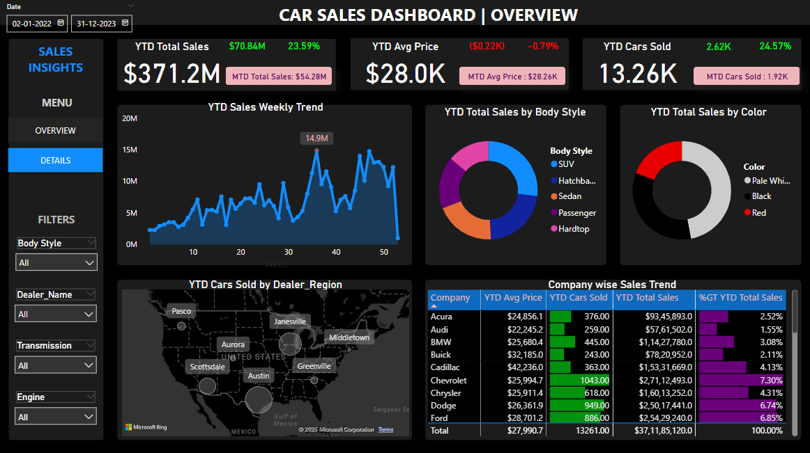
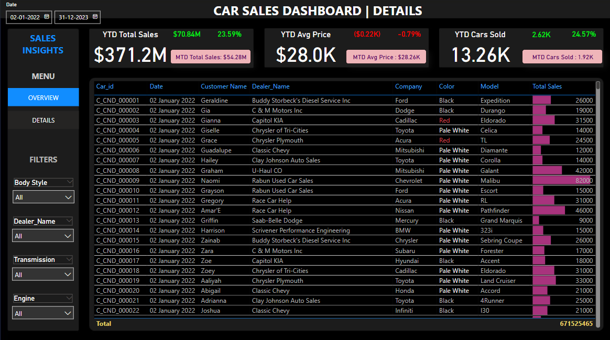

# 🚗 Car Sales Dashboard (Power BI) – Resume Project

*CAR SALES DASHBOARD | OVERVIEW*

---

## 📌 Project Summary

This **Car Sales Dashboard** is a dynamic, interactive BI solution built in **Power BI** to analyze and visualize key performance metrics across car sales data. It allows business users to track KPIs like total sales, average price, cars sold, and brand/dealer performance through visual storytelling and drill-down capabilities.

This is a **resume project** designed to demonstrate practical data visualization and reporting skills using real-world business logic.

---

## 🎯 Objective

To design and develop a comprehensive dashboard that enables:
- Real-time tracking of sales performance (YTD/MTD)
- Visual analysis of pricing, regional distribution, and dealer activity
- Business insights for improving inventory and pricing strategies

---

## ✅ Key KPIs & Metrics

### 📊 Sales Insights
- YTD Total Sales: **$371.2M**
- MTD Sales: **$54.28M**
- YTD Cars Sold: **13.26K**
- YTD Average Price: **$28.0K**
- YOY Growth in Total Sales and Cars Sold

### 📌 KPI Cards
- % Growth compared to Previous Year (PTYD)
- Difference in Sales, Cars Sold & Avg Price
- Weekly Peak Sales Indicator (e.g., Week 35 – $14.9M)

---

## 📊 Visualizations Included

### OVERVIEW PAGE:
- Line chart for **YTD Weekly Sales Trend**
- Donut charts for **Sales by Body Style** and **Color**
- Map chart for **Cars Sold by Dealer Region**
- Table view for **Company-wise Sales** with Avg Price and Total Sales Contribution

### DETAILS PAGE:

*CAR SALES DASHBOARD | DETAILS*

- Tabular view of **individual car sales** with fields like:
  - Customer Name, Dealer, Company, Model, Color
  - Sale Date, Total Sales Value
- Interactive filters for Body Style, Transmission, Engine, Dealer Name, and Date

---

## 🛠️ Tools & Features Used

- **Power BI Desktop**
- **Power Query** for data cleaning & shaping
- **DAX Measures** for KPIs and calculated metrics
- **Time Intelligence**: YTD, MTD, PYTD calculations
- **Custom Slicers & Conditional Formatting**
- **Map Visuals, Card KPIs, Line & Pie Charts**
- **Filters for 10+ attributes** to enable dynamic report interaction

---

## 📚 Skills & Concepts Covered

- ✅ Excel to Power BI integration  
- ✅ Data Cleaning & Modeling  
- ✅ Date Tables and Relationships  
- ✅ DAX: `CALCULATE`, `SUMX`, `MAXX`, `RANKX`  
- ✅ Time Intelligence (YTD, MTD, PYTD)  
- ✅ Custom Maps & Region Analysis  
- ✅ Interactive Dashboards and Navigation  
- ✅ KPI Cards, Visual Formatting, Tooltips  

---

## 🗂️ Files Included

- `Car_Sales.pbix` – Power BI file with Overview & Details pages  
- `Car_Sales_Dashboard_Overview.png` – Overview Image  
- `Car_Sales_Dashboard_Details.png` – Detailed Table Image  

---

## 👁️ How to Use

1. Download the `.pbix` file.
2. Open in **Power BI Desktop**.
3. Use the slicers (left panel) to filter by region, color, gender, engine type, etc.
4. Navigate between **Overview** and **Details** pages for high-level and granular insights.

---

